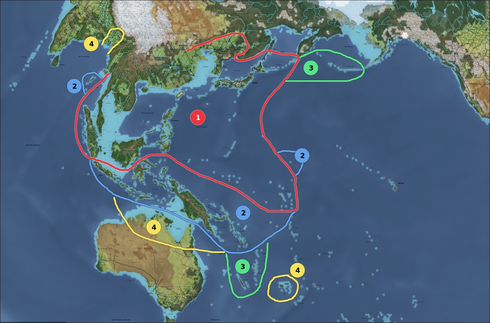

## Objetivos estratégicos del Imperio Japonés

Los objetivos de Japón en esta campaña se centrarán en tomar aquellas áreas de Asia y Oceanía con petróleo y los recursos necesarios para su industria; para posteriormente consolidar un perímetro defensivo y poder defender estos territorios de la respuesta armada de otras potencias. Éstas conquistas comprenden las regiones de las Indias Orientales Neerlandesa (Java, Borneo y Sumatra principalmente). El embargo Aliado a la importación de petróleo por parte del Imperio de Japón ha entrado en efecto y el país está funcionando con sus reservas; por lo que asegurar fuentes de petróleo y su transporte a la metrópoli es fundamental.

Como ante cualquier conflicto armado los países Aliados no tardarán en declarar la guerra a Japón, se ha decidido llevar a cabo el ataque propuesto por el Almirante Yamamoto contra la base americana de Pearl Harbor. Se ha conseguido la sorpresa y se han hundido varios acorazados que estaban anclados en dicha base. Para poder operar en el aŕea de interés, se han de neutralizar y tomar las de Hong Kong, Singapur y las Filipinas.

La presencia de la escuadra de portaaviones americanos en el Pacífico no debe ser ignorada; al igual que la presencia de la Fuerza Z británica y los cruceros australianos y holandeses. Es de vital importancia que dichas fuerzas no comiencen a operar de forma conjunta.

En China se huirá del combate directo cuando sea posible y se buscará cortar las
vías de suministro aliado (la carretera de Burma y el suministro soviético a través de Lanchow).

## Perímetro defensivo 

El perímetro defensivo que se desea establecer se realizará en 4 capas o niveles.

- **Capa 1**: El terreno mínimamente imprescindible para sobrevivir. Tomar Singapur
  y la península Malaya, Sumatra, Borneo y Filipinas. Empezar a levantar
fortificaciones y mejora de aeródromos y puertos. Expulsar a cualquier presencia
Aliada dentro de la zona.

- **Capa 2**: tomar Java, Papúa Nueva Guinea (imprescindible tomar y empezar a
fortificar Rabaul, Port Moresby y las Islas Salomón). Desembarcar en port Blair
y Wake para negárselas a los Aliados como bases avanzadas. Ambas bases serán
fortificadas y preparadas para ser bases de submarinos e hidroaviones con el fin
de hostigar el tráfico aliado hacia Australia, así como, desde Wake, alertar de posibles
incursiones hacia la metrópoli.

- **Capa 3**: si los objetivos anteriores se pueden conseguir antes del verano
de 1942, desearía lanzar dos operaciones con el objetivo de retrasar el posible
contraataque Aliado. Se trata de asaltar las Islas Aleutianas en el norte para
proteger las Kuriles y la metrópoli de un avance directo. En el sur, me gustaría
tomar Nueva Caledonia y las Nuevas Hébridas  para negar el puerto de Noumea a
los Aliados y aplicar presion a sus líneas logísticas con Australia. Todas estas posiciones exteriores del perímetro tienen como objeto estar fortificadas y alojar hidroaviones y submarinos para obstaculizar el esfuerzo logístico aliado a Australia y proteger las fuentes de petróleo de un contraataque Aliado todo el tiempo que sea posible.

- **Capa 4**: si aún fuese posible moverse ante el previsible potencial industrial y bélico Aliado de 1943, me gustaría realizar una serie de aventuras para ganar tiempo. En el este, desembarcar entre Calcutta, Dacca y Chittagong y avanzar ocupando el terreno hasta el Himalaya. Si se consigue la sorpresa, una fuerza no muy numerosa podría atrincherarse aprovechando el terreno (numerosos ríos y pantanos) con el objetivo de cortar todo el suministro terrestre a Burma (y desde Burma a China). Esta operación podría realizarse simultáneamente o justo después de la toma de Port Blair si las circunstancias lo permiten. Acabar con la resistencia en Burma podría liberar una gran cantidad de tropas que utilizar en otros teatros, pudiendo llegar a ser una baza muy importante para la victoria. En el centro-sur me gustaría lanzar una incursión relámpago en el norte de Australia, con el único objetivo de negar los aeródromos que allí se podrían establecer y que podrían permitir a los bombarderos de largo alcance (B-17 y B-24) destruir los campos petrolíferos de Java, Borneo y Sumatra. En el Sur-Oeste estaría bien poder tomar Fiji y utilizarla como base avanzada para hostigar el tráfico logístico Aliado.
