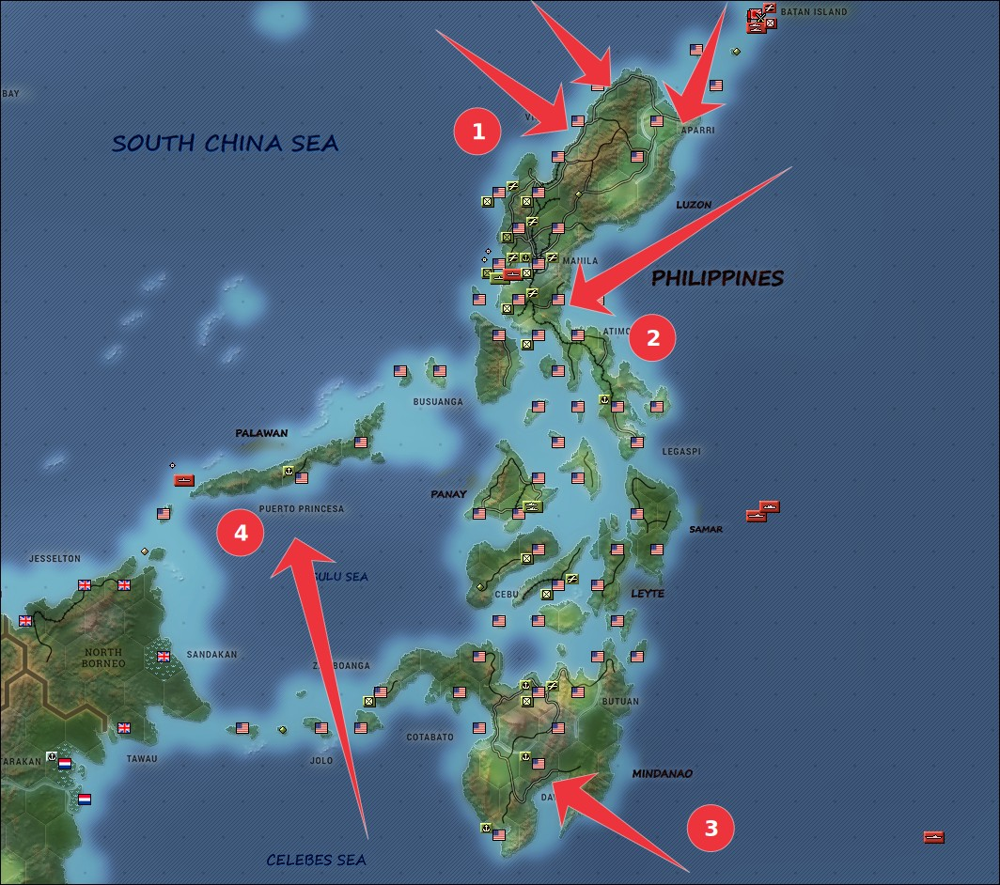
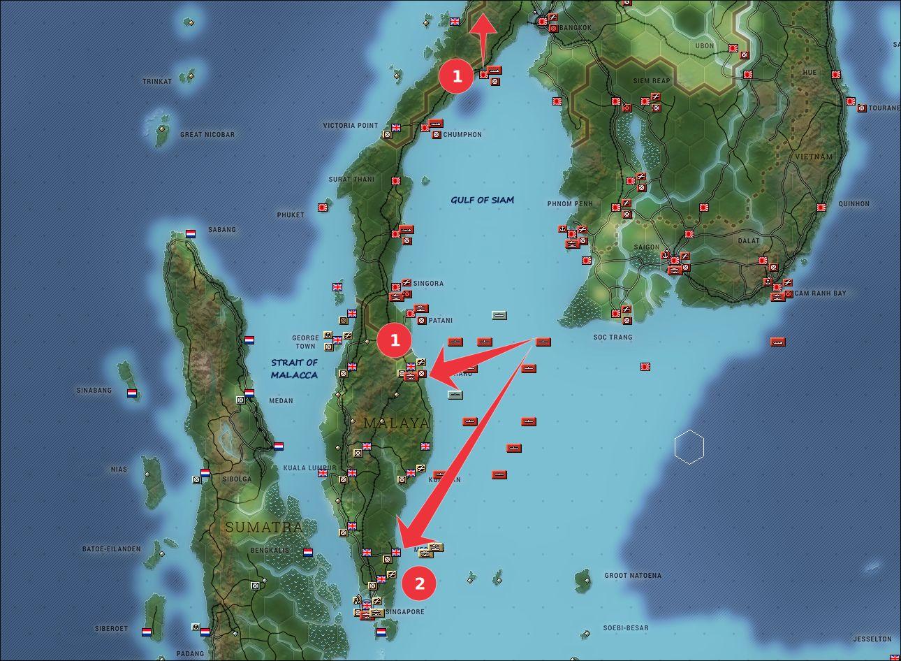

## Objetivos estratégicos del Imperio Japonés

Los objetivos de Japón en esta campaña se centrarán en tomar aquellas áreas de Asia y Oceacía con petróleo y los recursos necesarios para su industria; para posteriormente consolidar un perímetro defensivo y poder defender estos territorios de la respuesta armada de otras potencias. Éstas conquistas comprenden las regiones de las Indias Orientales Neerlandesa (Java, Borneo y Sumatra principalmente). El embargo Aliado a la importación de petróleo por parte del Imperio de Japón ha entrado en efecto y el país está funcionando con sus reservas; por lo que asegurar fuentes de petróleo y su transporte a la metrópoli es fundamental.

Como ante cualquier conflicto armado los países Aliados no tardarán en declarar la guerra a Japón, se ha decidido llevar a cabo el ataque propuesto por el Almirante Yamamoto contra la base americana de Pearl Harbor. Se ha conseguido la sorpresa y se han hundido varios acorazados que estaban anclados en dicha base. Para poder operar en el aŕea de interés, se han de neutralizar y tomar las de Hong Kong, Singapur y las Filipinas.

La presencia de la escuadra de portaaviones americanos en el Pacífico no debe ser ignorada; al igual que la presencia de la Fuerza Z británica y los cruceros australianos y holandeses. Es de vital importancia que dichas fuerzas no comiencen a operar de forma conjunta.

### Filipinas

Se ha planeado el desembarco de tropas así como el lanzamiento de algunos paracaidistas en el norte de la isla (1) para comenzar a aplicar presión sobre Manila y Clark Field. También se desembarcarán tropas en Atimonan para cortar posibles intentos de retiradas de tropas desde manila hacia el sur.

De forma posterior se llevarán a cano operaciones como el asalto anfibio y desembarco de tropas en Davao (3) y la ocupación de la base de Isla Princesa en Palawan (4).

Se han enviado submarinos a la salida del puerto de Manila y al mar de Sulu con intención de impedir la retirada hacia Borneo de navíos aliados y se desviarán fuerzas de cruceros y acorazados japoneses en cuanto haya terminado su labor de escoltar las fuerzas de desembarco. Se debe impedir la huida de las fuerzas Aliadas en Filipinas para proceder a su captura y desarme.

Las Filipinas serán sometidas a un poderoso bombardeo empleando bimotores escoltados por cazas. Son objetivos de especial interés los aeródromos con la intención de neutralizar los aviones allí presentes y el puerto de Manila para neutralizar la flota allí presente.

### Malasia

En Malasia, además de tomar bases a lo largo de toda la penínula Malaya, se lanzará un potente desembarco anfibio en Khota Baru (1). El plan inicial es cortar y aislar las unidades británicas presentes en la zona para sembrar el caos entre ellas.

Una vez hayan terminado sus labores de escolta, los acorazados rápidos Kongo y
Haruna se desplazarán a Mersing (2) para realizar un bombardeo de las fuerzas presentes allí. La intención es desembarcar allí más tropas que impidan que las tropas distribuídas a los largo de la península acudan a refugiarse en Singapur, dificultando aún más su conquista.

Sería deseable desplazar algunos portaaviones a la zona que puedan ayudar a proporcionar cobertura aérea al desembarco así como atacar los aeródromos cercanos. Si no se puede lanzar la flota de portaaviones japonesa contra su homóloga americana en las proximidades de Pearl Harbor, tal vez el siguiente mejor objetivo sea llevarla a esta zona para ayudar en la toma de Singapur y Palembang. 
